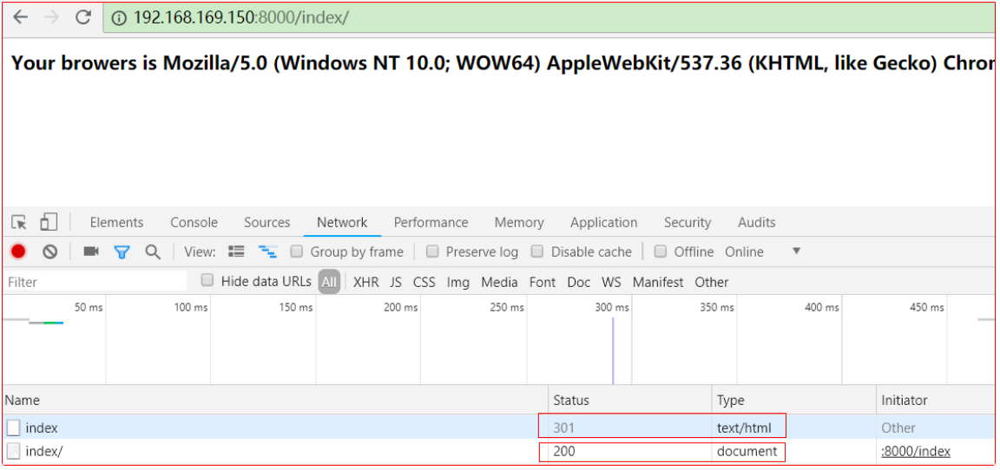

[toc]


#
todo
```
2.2 基于类的视图函数
4.2 app.config.from_object('config') 发生了什么


```

# 1 flask唯一URL原则


## 1.1 当路由配置成"/index"时
```
@app.route('/index')
def index_1():
user_agnt = request.headers.get('User_Agent')
return '<h5>Your browers is {}</h5>'.format(user_agnt)


### 两种测试情况
1. 浏览器访问 `192.168.169.150:8000/index`,状态码为200;
2. 当浏览器访问 `192.168.169.150:8000/index/`，状态码为404


```


## 1.2 当路由配置成"/index/"时
```
@app.route('/index/')
def index_1():
user_agnt = request.headers.get('User_Agent')
return '<h5>Your browers is {}</h5>'.format(user_agnt)
1. 浏览器访问 `192.168.169.150:8000/index/`,状态码为200;

2. 当浏览器访问 `192.168.169.150:8000/index`，状态码为301，然后浏览器再访问 `192.168.169.150:8000/index/`,状态码为200;

```


## 1.3 图示


# 2 视图函数
## 2.1 基于函数的视图函数
## 2.2 基于类的视图函数(即插函数)


# 3 路由的2种注册方法
## 3.1 flask的自动重启
## 3.2 经典注册方法
```
@app.route('/index/')
def index_1():
user_agnt = request.headers.get('User_Agent')
return '<h5>Your browers is {}</h5>'.format(user_agnt)

```
## 3.3 更灵活的注册方法
```
# 注意这个注册方法适合基于类的视图函数使用

def index_1():
user_agnt = request.headers.get('User_Agent')
return '<h5>Your browers is {}</h5>'.format(user_agnt)

app.add_url_rule("/index/", endpoint="index", view_func=index_1)


```


# 4 flask配置文件

## 4.1 传统使用方式
```
在项目目录下新建文件config.py
在内部写入如下配置
DEBUG = True

# 使用
from config import DEBUG

if __name__ == '__main__':
# debug设置为true时，将自动重启
app.run(host='0.0.0.0', port=8000, debug=DEBUG)

```

## 4.2 flask内置方式
```
在项目目录下新建文件config.py
在内部写入如下配置
DEBUG = True

# 注意，app.config有个默认的key叫做 DEBUG，所以需要在配置文件中将其重写覆盖
# 另外，app.config["word"]中word必须是大写的字符


# 使用

# 将配置文件config.py中的配置加载到app.config这个字典中
app.config.from_object('config')

if __name__ == '__main__':
# debug设置为true时，将自动重启
app.run(host='0.0.0.0', port=8000, debug=app.config['DEBUG'])

```

# 5 __name__ == "__main__"的理解

```
第一点 __name__ 作为入口时，__name__的值确实是"__main__"

第二点 在生产环境下 nginx+uwsgi中，py文件是作为一个模块加载的，在这种情况下，__name__的值是文件名而不是"__main__"

```


# 6 构建响应对象

```
# 普通响应
@app.route('/user1/<name>')
def user_1(name):
headers = {
"content-type": "text/plain",
}
response = make_response('<h1>hello {}</h1>'.format(name), 404)
response.headers = headers
return response


# 构建带有重定向的响应体

@app.route('/user1/<name>')
def user_1(name):
headers = {
"content-type": "text/plain",
"location": "index/1", # 重定向至内部路由
"location": 'http://www.baidu.com', # 重定向至外部网站
}
response = make_response('<h1>hello {}</h1>'.format(name), 301)
response.headers = headers
return response


# json格式响应体

@app.route('/user1/<name>')
def user_1(name):
headers = {
"content-type": "application/json",
"location": "index/1",
# "location": 'http://www.baidu.com',
}
response = make_response(simplejson.dumps('<h1>hello {}</h1>'.format(name)), 200)
response.headers = headers
return response


# 常用书写方法
@app.route('/user1/<name>')
def user_1(name):
headers = {
"content-type": "application/json",
}
return simplejson.dumps('<h1>hello {}</h1>'.format(name)), 200, headers

```


